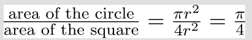
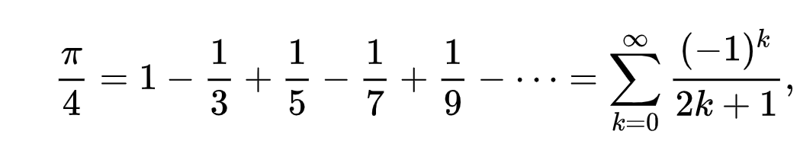
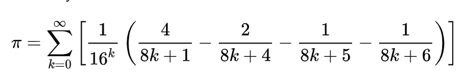
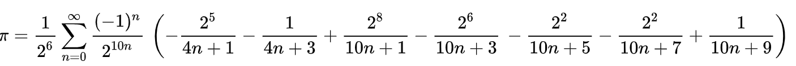

# Calculating Pi
## Intro
The number π (/paɪ/; spelled out as "pi") is a mathematical constant that is the ratio of a circle's circumference to its diameter, approximately equal to 3.14.

The number π appears in many formulae across mathematics and physics. It is an irrational number, meaning that it cannot be expressed exactly as a ratio of two integers, although fractions such as 22/7 are commonly used to approximate it.

Consequently, its decimal representation never ends, nor enters a permanently repeating pattern. It is a transcendental number, meaning that it cannot be a solution of an equation involving only finite sums, products, powers, and integers.

The transcendence of π implies that it is impossible to solve the ancient challenge of squaring the circle with a compass and straightedge. The decimal digits of π appear to be randomly distributed, but no proof of this conjecture has been found.
## Algorithms
### Monte Carlo
Monte Carlo methods, are a broad class of algorithms used to calculate certain amounts, using random sampling. One of the first problems that was solved by this method was the Buffon's needle problem, in which π can be estimated by dropping needles on a floor randomly.

Another way of calculating Pi with this method is like this: Imagine there is a square, with 2r as its width. And a circle bound inside it. we can calculate Pi using this formula:

The Problem with This Method: The computational cost of this method can be really high. This is not an optimal method for calculating Pi with 1000 floating points.

### Gregory-Leibniz Series

This is a really simple method for calculating Pi. The way to implement this is to create a class that either extends the Thread class, or implements the Runnable interface. Then we can assign one or more fields of this series to be calculated by each instance.

The Problem with This Method: It converges extremely slowly. Calculating π to 10 correct decimal places using direct summation of the series requires precisely five billion terms. So, this is not an optimal way for calculating Pi either.

* I used this algorithm first. For this, I used 100 threads, each of which counts 100,000 sentences of this series. But in the end it was correct only up to 7 decimal places.

### BBP Formula

The Bailey–Borwein–Plouffe formula (BBP formula) is a formula for π. Brief History: It was discovered in 1995. It was wildly believed that computing the nth digit of Pi would be as difficult as calculating the first n digits; but the existence of this formula proved that to be wrong. It is worth to note that even though we can calculate any given digit of Pi with less computational effort than other formulas, it still will take increasingly more time to calculate further digits.

* algorithm is: O(nlog(n))
#### How I implemented this method:
Implementing the BBP class. This class implements the Runnable interface. I used 100 threads in `Bailey_Borwein_Plouffe_Formula()` method to calculate pi number faster. Each thread is connected to an object of the BBP class and starts from the number n and counts up to a hundred sentences every time. Pay attention that for the correctness of the work, the accuracy of the calculations should be slightly more than 1000 digits, so I chose it 1003.

### Bellard's Formula
This formula is said to be 43% faster than BBP formula.

# Semaphore
#### The best way to say what a semaphore is, It can be use like `Lock` but you can lock as many as threads you want.
* A Semaphore is used to manage a resource that is going to be accessed by multiple users. It can manage the access by letting a few numbers of threads to run, and holding others till one the running threads finishes processing. This is not the same as locking a resource, as there could only be one user/thread that could access that resource at a given time. A semaphore can let multiple threads to access the resource at once.

##### The task is simple:
1. It wants us to Lock 2 threads at the same time using semaphore until they finished.
2. Shows which thread has done its task.
* #### I simply declare a semaphore in main method by using `Semaphore semaphore = new Semaphore(2);`.
* #### The number 2 is how many threads I want to lock in Operator class. So you can change it and lock as much as you want.
* #### **(It's really important to use a single semaphore for the whole program and pass it to methods)**
* #### in `accessResource()` method where located in Resource class, I acquired the semaphore at the first of the method, And I release the semaphore at the end of it where the task of **Accessing to Resources** has done.
* #### So when we want to lock some threads at the same time we use Semaphore.
* note that if you want to use Semaphore you have to import its class.
# Resources
* [Formulas to find π (Wikipedia)](https://en.wikipedia.org/wiki/Pi)
* [Thread Pools (Geeks for Geeks)](https://www.geeksforgeeks.org/thread-pools-java/)
* [Semaphore (Geeks for Geeks)](https://www.geeksforgeeks.org/semaphore-in-java/)
